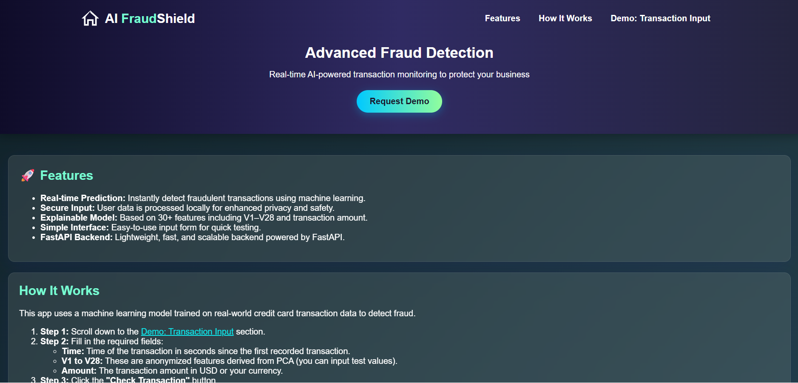
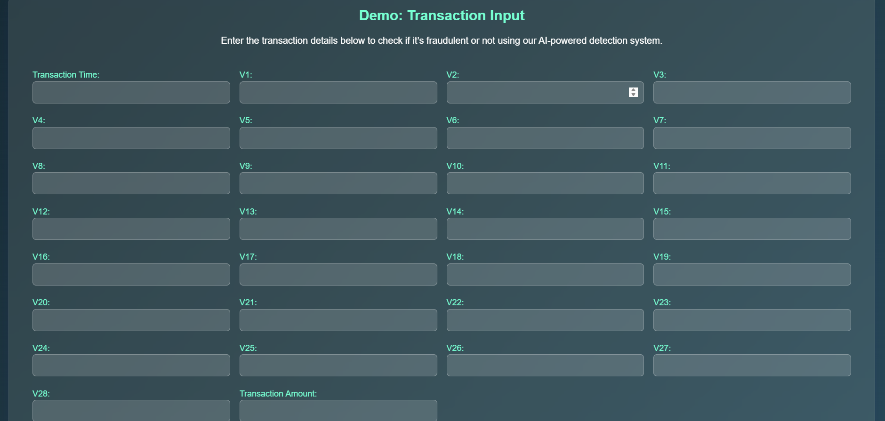

# 💳 AI FraudShield

**AI FraudShield** is a Flask-based web application that detects fraudulent credit card transactions using a trained machine learning model. The app allows users to input key features extracted from transaction data and receive an instant prediction.

 

## 🚀 Features

- ⚠️ Predicts whether a transaction is **fraudulent** or **legitimate**
- 🧠 ML-powered classification using Scikit-learn
- 📊 Based on real-world anonymized credit card transaction data
- 🌐 Simple and responsive frontend with HTML/CSS
- 💡 Educational explanation of how the system works

 

## 🛠️ Tech Stack

- **Frontend**: HTML5, CSS3, JavaScript
- **Backend**: Python, Flask
- **ML**: Scikit-learn, Pandas, NumPy
- **Deployment**: Flask built-in server (or deploy on Render, Heroku, etc.)

 

## 🧪 Model Training Overview
**Dataset:** Kaggle Credit Card Fraud Dataset (credit_data.csv)

**Preprocessing:**

- Removed duplicates

- Used only relevant features (V1–V28, Amount, Time)

- Balanced using stratified sampling

**Model:**

- Trained a Random Forest Classifier

-Achieved high precision and recall

**Exported Model:**

- Saved as fraud_model.pkl

**Training script:** train_model.py

 

## 🖥️ Preview 

 

 

## 📂 Project Structure

credit-fraud-api/  
├── static/ 
|   ├── index.html 
|   ├── script.js  
│   └── assets/  
│       ├── fraud.png  
│       └── legit.png  
├── fraud_model.pkl  
├── train_model.py
├── main.py  
├── requirements.txt
├── LICENSE
└── README.md

 

## 🧪 Run Locally

1. **Clone the repo**
   
   git clone https://github.com/mahnoorimran563/ai-fraudshield.git
   cd ai-fraudshield
   
2. **Create virtual environment (optional but recommended)**

  python -m venv venv
  venv\Scripts\activate   # On Windows
  
3. **Install dependencies**

  pip install -r requirements.txt
  
4. **Run the Flask app**
   
  python app.py
  
5. **Open in browser**
   
  http://localhost:5000
  
 

🔒 License
This project is licensed under the MIT License.

 
🙋‍♀️ Author
Mahnoor Imran
💼 LinkedIn
📧 mahnoorimran563@gmail.com

Made with 💻 and ☕ by Mahnoor
